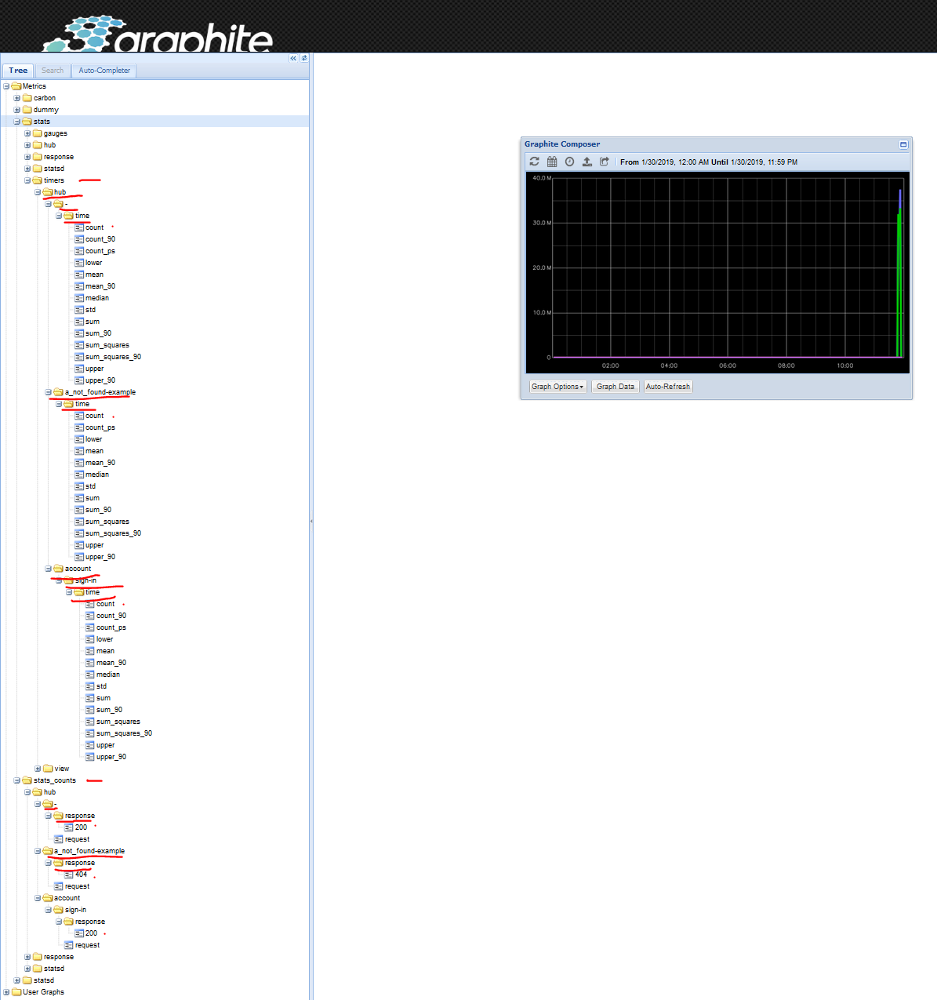

# Graphite

First of all you need a running statsd and optionally, graphite or other metrics collector.

Execute the command below to start graphite and statsd via docker container.

```sh
$ docker run -it --rm --name graphite -p 80:80 -p 2003-2004:2003-2004 -p 2023-2024:2023-2024 -p 8125:8125/udp -p 8126:8126 graphiteapp/graphite-statsd
```

Now, it's time to run our Go + StatsD example, just execute `go run main.go`.

- The example Go web server runs on `http://localhost:8080`
- The Graphite's web UI is located at `http://localhost`.
- The StatsD listens on `UDP:8125` via the docker container as well.

Do some requests and view the results on the graphite's web UI.

Example screenshot of a `"hub."` prefix metrics (with 1sec, 2sec,4sec and 5sec simulation of some requests):

