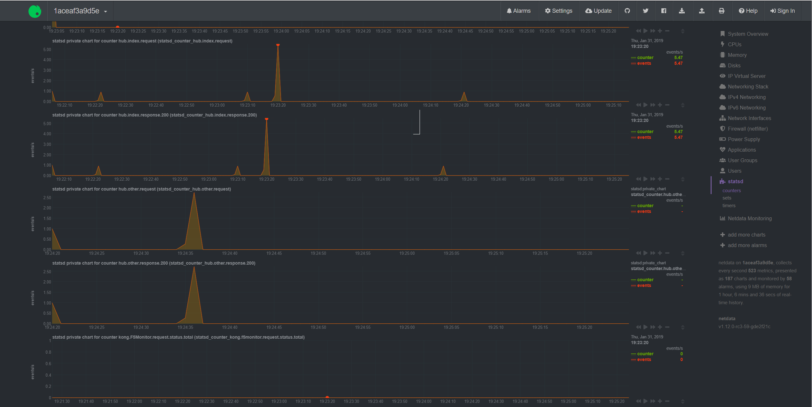

# Netdata

First of all you need a running netdata deamon, [netdata](https://github.com/netdata/netdata) comes
with statsd out of the box. Get it [here](https://docs.netdata.cloud/packaging/installer/).

Netdata + statsd documentation can be found at: https://docs.netdata.cloud/collectors/statsd.plugin/

If you don't have a running netdata instance you can follow the next section.

## Install netdata using Docker

Netdata has a docker hub repository available for you: https://hub.docker.com/r/netdata/netdata/.

However, we are starting from zero, so we have a custom `Dockerfile` which copies the
[./netdata.conf](netdata.conf) to the netdata's configuration path, in order to allow `netdata statsd` 
to accept UDP packets from the host machine.

```
[statsd]
    ...
    default port = 8125
    bind to = udp:*
```

See the [./Dockerfile](Dockerfile) for more details.

### Build

```sh
$ docker build --tag=netdata-statsd .
```

### Run

```sh
$ docker run --rm -it -p 8125:8125/udp -p 19999:19999 netdata-statsd
```

Execute the command below to start netdata when inside the container: 

```sh
$ netdata
```

## Running the example

Now, it's time to run our Go + StatsD example, just execute `go run main.go`.

- The example Go web server runs on `http://localhost:8080`
- The netdata's web UI is located at `http://localhost:19999`.
- The netdata StatsD plugin listens on `UDP:8125` via the docker container as well.

Do some requests and view the results on the [netdata's web UI](http://localhost:19999/#menu_statsd_submenu_counters;theme=slate;help=true).

Example screenshot of a `"hub."` prefix multi-metrics:


